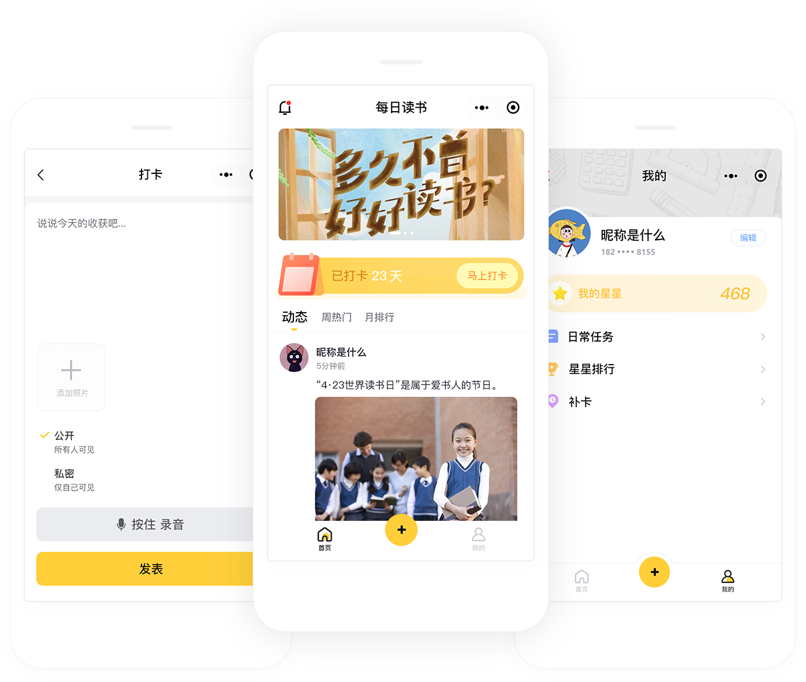

# 西安组

## 业务报名系统
- 版本： V2.5 | PC端 & 微信小程序
- 需求方：集团教务及学科

### 前台
- 面向校区主管和行政使用，有报名收费转班调课，以及查询对账退费等功能。
> 
### 后台
- 面向教务使用，具有校区教室课程班级教师管理等功能。
> 
### 财务
- 面向财务、人资、校长和教务使用，主要有收入和确认收入查询、订单退费管理、 变动和签到记录，财务主体的管理，转班查询等功能。
> 
### 学科
- 面向学科和校长使用，主要有班级运营数据和学员运营数据、产品分析等。
> 
### 配置
- 面向管理员使用，主要有用户和权限管理，操作日志，中小学、标签和 App 配置等。 支付和转账:对接交行智能 POS，银企直联转账功能，实现校区收退款。
> 

## 管理端小程序
- 版本： V1.0

- 面向教师和行政使用，主要是用于教师签到学员签到等。
> 

## 营业厅小程序
- 版本： V6.1

- 微信的电商平台，支持移动端业务办理。
> 

## 预算系统
- 版本： V1.3 | PC端

- 用于公司所有部门的月预算管理，包含常规预算，采购预算，办公预算的审批流程等，以及预算分析汇总及执行的情况管理。
> 

## 高联竞赛网站
- 版本： V1.2 | PC端 & Mobile

- 高中竞赛部门官网内容，主要包含新闻中心，根源杯成绩查询，竞赛攻略，学科资讯等功能。
> 

## 视频学习系统
- 版本： V1.0 | PC端 & Mobile

- 用于员工技能学习，教师教研，学员补课等分析学习时长测评统计等
> 

## 打卡小程序
- 版本： V1.0

- 维护家长群的文字视频语音打卡分享，任务奖励工具。
> 
