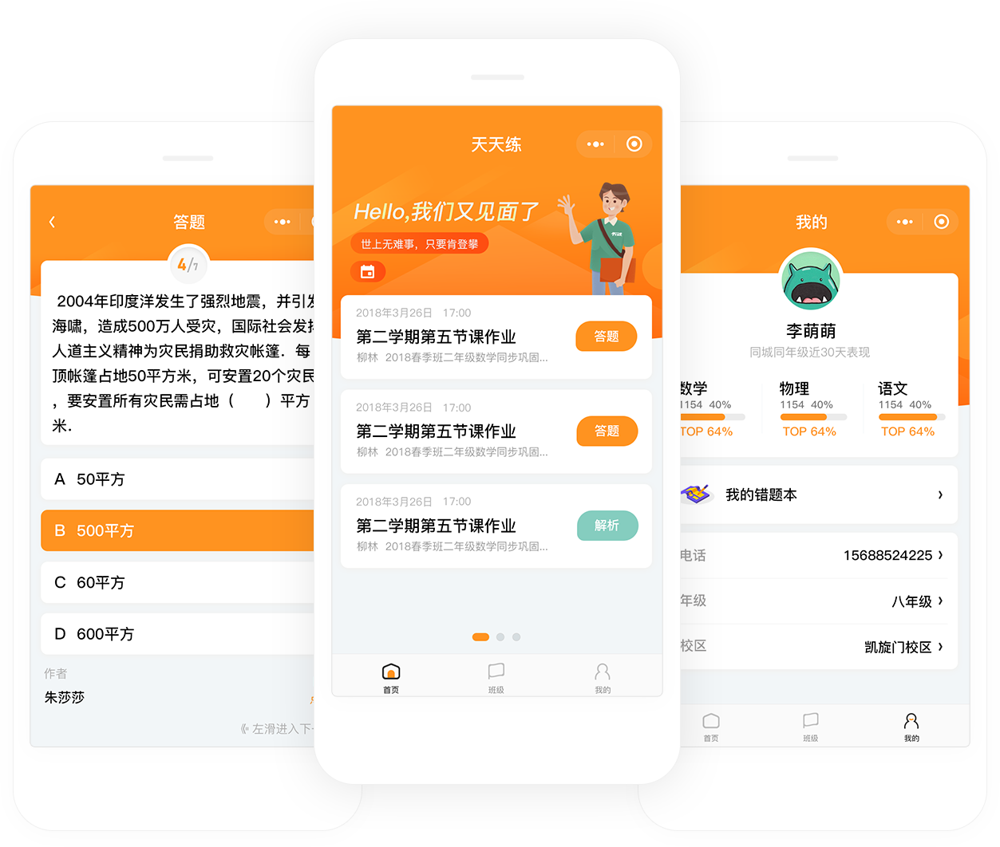
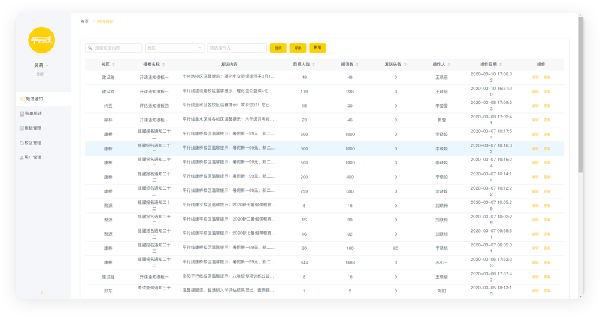
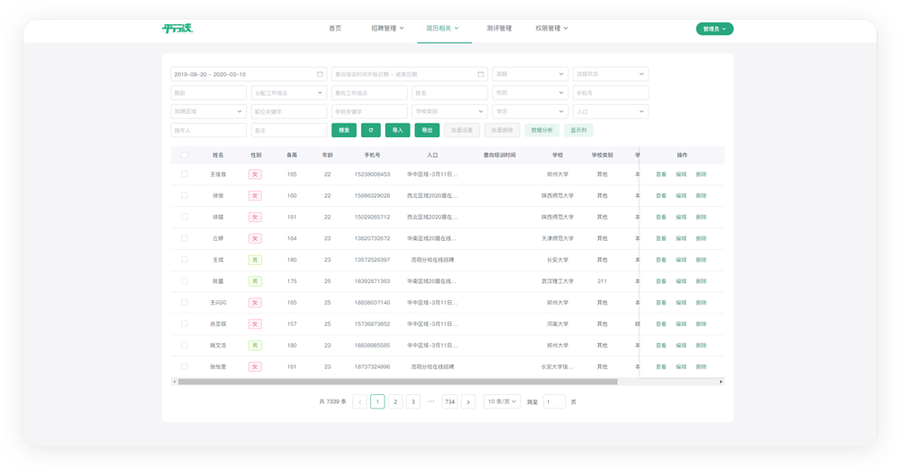
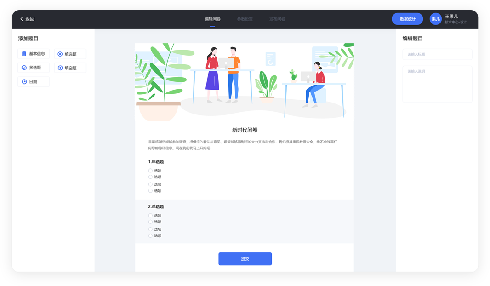
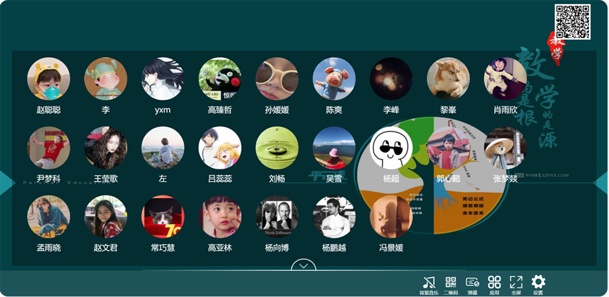

# 郑州组

## 天天练
- 版本： V2.0 | PC端 & 微信小程序

- 用于学员及新用户的学习练习，以及题目编辑、解析、视频讲解，班级和老师，形成对老 学员的维护和新用户的推广作用。
> 

## 短信平台
- 版本： V1.0 | PC端

- 用于短信模板批量发送短信通知，推广等，面向新老学员家长及时发送最新信息。
> 

## 网申系统
- 版本： V2.0 | PC端 & Mobile

- 校园招聘管理系统，包含多入口管理，简历管理和筛查，签到抽奖，流程统计，面试评价 功能等完整。
> 

## 官网
- 版本： V2.0 | PC端 & Mobile

- 平行线官网的课程发布及介绍，教师资料，校区查询，资料共享，成绩查询平台。
> 

## 问卷
- 版本： V1.0 | PC端 & Mobile

- 由于市面上产品多存在不足和限制，为方便公司同事使用的一款便捷型数据收集软件。
> 

## 年会抽奖系统
- 版本： V1.0 | PC端

- 大型活动签到 3D 展示效果，抽奖，现场互动等功能活动平台。
> 
